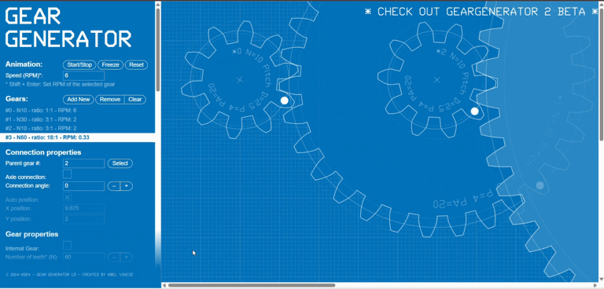

# Mechanical-Gears-Task

هذا المستودع يحتوي على إنجاز المهمة من محاضرة الأسبوع السادس (سيشن الميكانيكا)، والتي قدمتها شركة **الأساليب الذكية** بشرح المهندسة Wafaa Almadhoun.

---

## ⚙️ المهمة الأولى: نسبة 18:1

المطلوب كان تصميم وتحريك نظام مكون من 4 تروس لتحقيق نسبة تخفيض إجمالية (Total Gear Ratio) تبلغ **18:1**.

### 💡 طريقة الحل

للوصول إلى نسبة 18:1، تم استخدام نظام **التروس المركبة (Compound Gears)** عن طريق ضرب نسبتين معاً: **(3:1) * (6:1)**.

تفاصيل التروس كالتالي:

* **المجموعة الأولى (نسبة 3:1):**
    * الترس القائد (A): **10 أسنان**.
    * الترس المنقاد (B): **30 سن**.
* **المجموعة الثانية (نسبة 6:1):**
    * الترس القائد (C): **10 أسنان** (مركب على نفس محور الترس B).
    * الترس المنقاد (D): **60 سن**.

**الحسبة الإجمالية:**
(30 / 10) * (60 / 10) = 3 * 6 = **18:1**

---

### 🎥 العرض التوضيحي

هنا يظهر التصميم وهو يعمل. الترس القائد (الأول) يكمل 18 دورة مقابل دورة واحدة فقط للترس المنقاد (الأخير).

**ملف GIF للمحاكاة:**

---

### 🛠️ الأداة المستخدمة

تم استخدام موقع [GearGenerator.com](https://geargenerator.com/) لتصميم ومحاكاة حركة التروس.

* **رابط التصميم التفاعلي:** [https://geargenerator.com/#...](https://geargenerator.com/#200,200,100,6,1,3,6656.100000001114,4,1,10,2.5,4,20,0,0,0,0,0,0,0,30,7.5,4,20,0,0,0,0,0,1,1,10,2.5,4,20,0,0,0,0,0,2,0,60,15,4,20,0,0,0,0,0,0,1,3,-565)

---

### 📋 ملاحظات حول المهمة الثانية (Planetary Gearbox)

**المطلوب في المهمة:**
كانت المهمة الثانية تهدف إلى رسم المكونات الأساسية لـ "صندوق التروس الكوكبي" (Planetary Gearbox). استناداً إلى شرح المهندسة، يتكون هذا النظام بشكل أساسي من:
1.  **الترس الشمسي (Sun Gear):** ترس مركزي.
2.  **التروس الكوكبية (Planet Gears):** تروس أصغر تدور حول الترس الشمسي.
3.  **الترس الحلقي (Ring Gear):** ترس كبير بأسنان داخلية يحيط بالمجموعة بأكملها.

**سبب عدم إكمال المهمة:**
واجهتُ صعوبة تقنية أساسية تمثلت في إيجاد خاصية **"الترس الداخلي" (Internal Gear)** في برامج التصميم المتاحة. حسب بحثي هذه الخاصية ضرورية لرسم "الترس الحلقي" (Ring Gear) بشكل صحيح.

* **الأدوات التي تمت تجربتها:** تم تجربة عدة منصات تصميم مثل `GearGenerator.com` و `TinkerCAD` و `Onshape`.
* **التحدي التقني:**
    * في `GearGenerator`، واجهت مشكلة في محاذاة الترس الداخلي مع الترس الشمسي في نقطة المركز (0,0).
    * في `TinkerCAD`، لم أتمكن من العثور على "مولد الأشكال" (Shape Generator) الصحيح الذي يوفر خيار تحويل الترس إلى "داخلي".
    * في `Onshape`، يتطلب الأمر إضافة أداة مخصصة (FeatureScript). بعد تجربة أكثر من 20 أداة متاحة من صنع مستخدمين آخرين، لم أجد واحدة تحتوي على خيار `Internal` بشكل واضح وفعال.

**كيف يمكن تنفيذها (الطريقة الصحيحة):**
الطريقة الصحيحة لإنجاز هذه المهمة في برنامج تصميم هندسي (CAD) مثل Onshape أو Fusion 360 هي:
1.  البحث عن أداة `Spur Gear` (أداة إنشاء التروس) موثوقة تدعم الخيارات المتقدمة.
2.  استخدام الأداة لإنشاء 3 أجزاء:
    * **Sun Gear:** ترس عادي بعدد أسنان معين (مثلاً: 20).
    * **Planet Gear:** ترس عادي أصغر (مثلاً: 20).
    * **Ring Gear:** ترس بنفس الأداة، ولكن مع تفعيل خيار **`Internal`** (داخلي) وإدخال عدد أسنان مناسب (مثلاً: 60).
3.  الانتقال إلى وضع "التجميع" (Assembly) ومحاذاة الترس الشمسي والحلقي في نفس المركز، ثم وضع التروس الكوكبية في الفراغ بينهما

كل الشكر للمهندسة Wafaa Almadhoun على إرشادها
